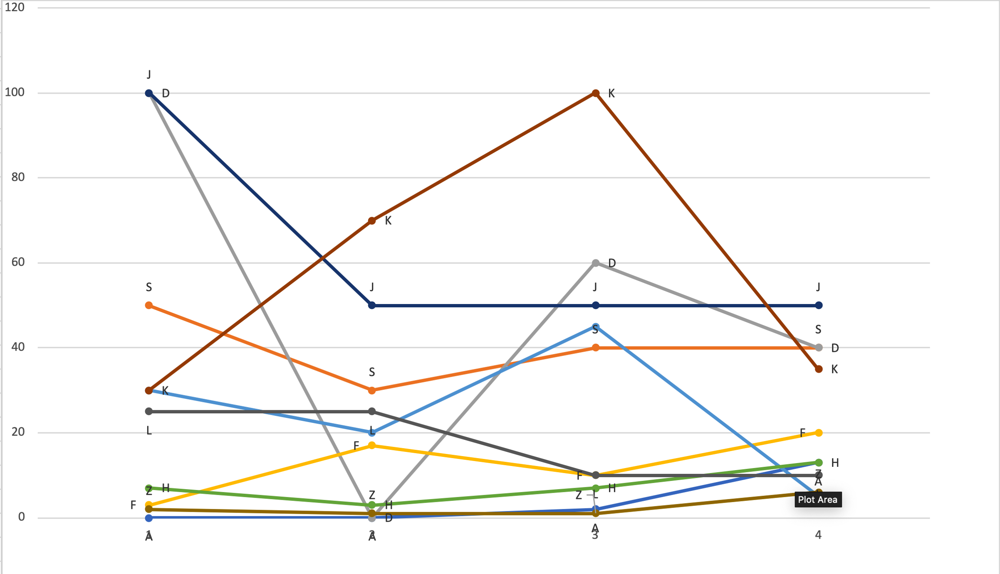

#Trending Calculator

##Overview
Trending Calculator is a library for calculating the trending models out of the given list of data.The algorithm takes into account two parameters for calculating the trending models out of the given list of data:-

1. The spike i.e., the trends indicating the picking up of a particular model.
1. The quantity in which the model is picked up.

## Installation
To install this library, please download the latest version of  [NuGet Package](https://www.nuget.org/packages/<>/) from [nuget.org](https://www.nuget.org/) and refer it into your project.

##How to use it
The library takes four input parameters:-

1. Enum of the type **TrendsCalculationStrategy** which has two predefined enumeration values signifying the type of stratregy required in filtering of results:
   1. **ZMean**:- This constant evaluates and return trending models based on the Z mean value (threshold value is z mean value).
   2. **Custom**:- This constant gives the the entire list sorted in order of trends evaluated (sorted by global Z, local Z).

2. **windowPeriod**:- This integer input defines the period over which the trending models are to be calculated.

3. **numberOfSegmentsOfEachUnit**:- This integer input defines the value that each unit(days/months/year whichever is the unit of the *windowPeriod*, is divided into a particular number of segments.

4. **listOfModels<T>**:- This is the input data provided to the algorithm with the list of models over which the trending is to be calculated.
   1. *listOfModels* should implement the interface *TInterface* of the library which contains the following three attributes: *LocalZ*(double),*GLobalZ*(double),*countWithPeriods*(a list of integer type)
   2. countWithPeriods consists of the number of times a particular model was consumed in the segments of the windowPeriod. Mathematically speaking , CountWithPeriods.Count should be >= *windowPeriod x noOfSegmentsOfEachUnit* and <= (windowPeriod+1) x noOfSegmentsOfEachUnit.
    
    Each of the model type T, should inherit from the TInterface of the NuGet package.
    
    The algorithm takes into account the virtual windowsPeriod, lets say the algorithm is run for the windowPeriod of 6 months in the month of June 2020 and the data for June is not yet complete, so in order to compensate for that , the data can be provided for December 2019 to June 2020.If not using the virtual windowPeriod, the data must be provided for January 2020 to June 2020.

First, an object of the TrendingDataCalculator class needs to be instantiated with the constructor which takes Enum as input defining the strategy.The example of the code is :-
```
var trendingDataCalculator = new TrendingDataCalculator<YourTrendingModelType>(TrendCalculationStrategy.ZMean);
```
or
```
var trendingDataCalculator = new TrendingDataCalculator<TrendingSkillsModel>(TrendCalculationStrategy.Custom);
```

The created object then calls the EvalAndGetTrendingData() which takes the three arguments as input : windowPeriod(integer type), numberOfSegmentsOfEachUnit(integer type), listOfModels(list of the models)
```
trendingDataCalculator.EvalAndGetTrendingData(windowPeriod, numberOfSegmentsOfEachUnit, listOftrendingModels);
```
The method returns the list of models in the trending order as per the strategy specified in the Enum.

##How it works:
The algorithm works on the principle of mathematical stastics conepts of 'Z' value which is calculated from the mean and standard deviation.

**ZValue = (observation - mean) / standardDeviation**

The algorithm divides the windowPeriod into two segments the history period and the trending period.

For each of the model, the mean and standard deviation is calculated taking the history segment values into account.Then for each of the values in the trending segment of each model, the Z values are calculated.The mean of these Z values gives the LocalZ value for each model.

Next we take all the values from the history segment of all the models and calculate mean and standard deviation.This common value of mean and standard deviation is applied to each of the values for a particular model in the trending segment and caluclate the Z values.The mean of these Z values gives out the GlobalZ value for each model.

##Result Calculation:-

1. **For the ZMean Strategy** :-
   * The mean of the GlobalZ values for each model is calculated.The models having value of GlobalZ greater than the mean GLobalZ value are taken into the trending list.The trending list is then sorted on the GlobalZ values with the top model being the one with highesh GlobalZ value.The list is then returned.

2. **For the Custom Strategy**:
   * The models are sorted out into three categories:
     1. Models having positive GlobalZ and LocalZ values
     2. Models having alternate signs of GlobalZ and LocalZ values
     3. Models having negative GLobalZ and LocalZ values
     
   Since the GLobalZ is the relativity parameter which tells whether a particular model was picked up more than the other models in the trending segment as compared to the history segment, and LocalZ is the local parameter for a particular model which tells whether a particular skill was picked up more in the trending segment(positive value) as compared to the history segment, the order of the categories mentioned above is 1>2>3
   The models then in the category 1 and category 3 are sorted in descending order of GlobalZ values and models in the category 2 are sorted in the descening order of LocalZ values.The result is combined and then returned.
   
An example of the model :-
      
      windowPeriod=2 months ;
      numberOfSegmentsOfEachUnit=2
      
The table when plotted looks like :-

(with the count for each segment represented on Y-axis and the 15 days segment represented on X-axis)


Based on the **Custom Strategy** the order of the skill name are: ***K>J>D>S>G>F>H>L>A>Z***

Based on the **ZMean Strategy** the order of the skills are: ***K>J>D>S***
(only 4 out of the given 10 are taken into account for trending, because these skills had their GlobalZ value greater than or equal to mean of all GlobalZ values.

## Contributing

This project welcomes contributions and suggestions.  Most contributions require you to agree to a
Contributor License Agreement (CLA) declaring that you have the right to, and actually do, grant us
the rights to use your contribution. For details, visit https://cla.opensource.microsoft.com.

This project has adopted the [Microsoft Open Source Code of Conduct](https://opensource.microsoft.com/codeofconduct/).
For more information see the [Code of Conduct FAQ](https://opensource.microsoft.com/codeofconduct/faq/) or
contact [opencode@microsoft.com](mailto:opencode@microsoft.com) with any additional questions or comments.


