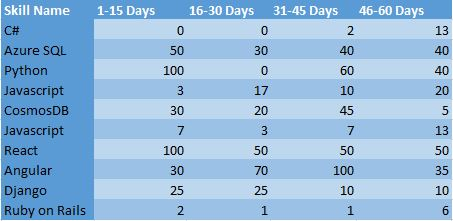
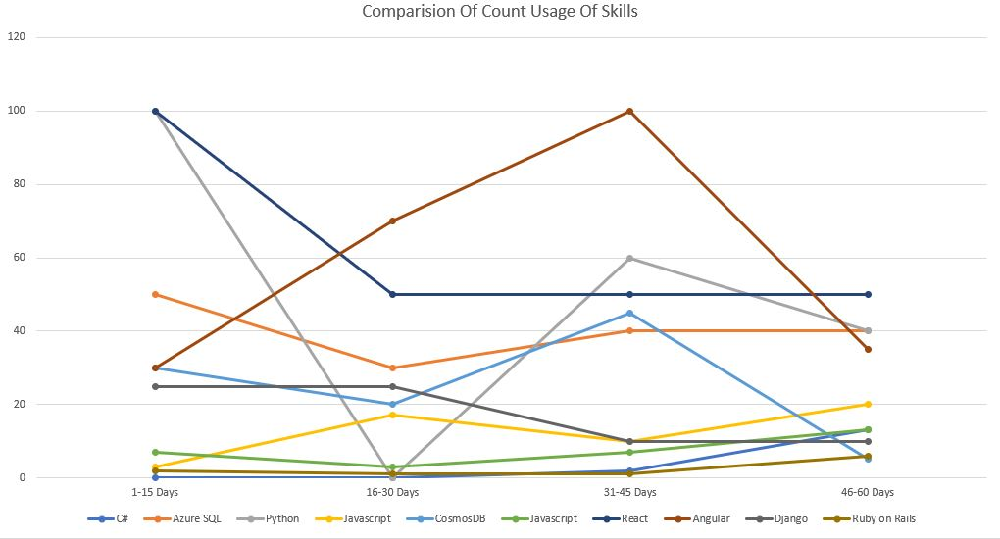

# Trending Calculator

## Overview
Trending Calculator is a library for calculating the trending models out of the given list of models.The algorithm takes into account two parameters for calculating the trending models out of the given list of data:-

1. The spike i.e., the trends indicating the picking up of a particular model.
1. The quantity in which the model is picked up.

## Installation
To install this library, please download the latest version of  [NuGet Package](https://www.nuget.org/packages/TrendsCalculator/) from [nuget.org](https://www.nuget.org/) and refer it into your project.

## How to use it
The library takes four input parameters:-

1. Enum of the type **TrendsCalculationStrategy** which has three predefined enumeration values signifying the type of stratregy required in filtering of results:
   1. **ZMean**:- This Enum evaluates and return trending models based on the Z mean value (threshold value is z mean value).
   2. **Custom**:- This Enum gives the the entire list sorted in order of trends evaluated (sorted by global Z, local Z).

2. **windowPeriod**:- This integer input defines the period over which the trending models are to be calculated. The unit of measurement of time period is irrevelant here. Say for example, you have three months of data for usage of your model, then the windowPeriod would be 3. If you have the 25 days of data for usage of your model, then the windowPeriod would be 25.

3. **numberOfSegmentsOfEachUnit**:- This integer input defines the value that each unit(days/months/year whichever is the unit of the *windowPeriod*, is divided into a particular number of segments. For example, let's say, you have collected data for your models for 6 months, divided into 3 segments of 2 months each, then the value of this input parameter would be 3.

4. **listOfModels<T>**:- This is the input data provided to the algorithm with the list of models over which the trending is to be calculated.
   1. *T* should extend the class *TModel* of the library, in case the user choses *ZMean* or *Custom* TrendsCalculationStrategy as mentioned in the point 1 which contains the following attribute: *CountWithPeriods*(a list of integer type), or *T* should extend the class *TDemandSupplyModel* of the library, in case the user choses to evalute the trending data via the *Demand-Supply* :  *CountWithPeriods*(a list of integer type), *SupplyQuantity*(an integer which signifies the actualy supply or consumption of the skill).

   *Demand-Supply* here means, that the model usage count which user provides as input via *CountWithPeriods* is the demand of the model, and *SupplyQuantity* will indicate the actual usage or consumption of that model. The trending order of models is then calcualted taking this scenario in consideration.

   2. countWithPeriods consists of the number of times a particular model was consumed in the segments of the windowPeriod. Mathematically speaking , CountWithPeriods.Count should be >= *windowPeriod x noOfSegmentsOfEachUnit* and <= *(windowPeriod+1) x noOfSegmentsOfEachUnit*.
    
    Each of the model type T, should extend from either the TModel or the TDemandSupplyModel of the NuGet package.
    
    The algorithm takes into account the virtual windowsPeriod, lets say the algorithm is run for the windowPeriod of 6 months in the month of June 2020 and the data for June is not yet complete, so in order to compensate for that , the data can be provided for December 2019 to June 2020.If not using the virtual windowPeriod, the data must be provided for January 2020 to June 2020.

First, an object of the TrendsCalculator class needs to be instantiated with the constructor which takes Enum as input defining the strategy.The example of the code is :-
```
var trendingCalculator = new TrendsCalculator.Library.TrendsCalculator();
```

The created object then calls the FindTrendingData() which is an overloaded method:
1. First overloaded implementation of the function takes four arguments as input : windowPeriod(integer type), numberOfSegmentsOfEachUnit(integer type), listOfModels(list of the models, the model should extend the base class TModel) & enum of the type TrendCalculationStrategy.
```
trendingCalculator.FindTrendingData(6, 1, inputData, TrendCalculationStrategy.Custom);
```
or
```
trendingCalculator.FindTrendingData(6, 1, inputData, TrendCalculationStrategy.ZMean);
```

2. Second overloaded implementation of the function takes three arguments as input : windowPeriod(integer type), numberOfSegmentsOfEachUnit(integer type), listOfModels(list of the models, the model should extend the base class TDemandSupplyModel)
```
trendingCalculator.FindTrendingData(6, 1, inputData);
```

The user can call any of the above implementations of the FindTrendingData() as per use-case.

The method returns the list of models in the trending order as per the strategy specified in the Enum.

##How it works:
The algorithm works on the principle of mathematical stastics conepts of 'Z' value which is calculated from the mean and standard deviation.

**ZValue = (observation - mean) / standardDeviation**

ZValue is the statistical quantitative numerical value which accounts for the spikes in the usage of model, and provides us the very basis for comparision.

The algorithm divides the windowPeriod into two segments the history period and the trending period.

For each of the model, the mean and standard deviation is calculated taking the history segment values into account.Then for each of the values in the trending segment of each model, the Z values are calculated.The mean of these Z values gives the LocalZ value for each model. 

LocalZ value determines whether the model's demand has spiked in the trending segment as compared to its historical segment. A positive value indicates the model is in demand, a negative value indicates the model's demand has reduced as compared to the historical segment.

Next we take values of all models from the history segment and calculate mean and standard deviation.This common value of mean and standard deviation is applied to each of the values for a particular model in the trending segment and caluclate the Z values.The mean of these Z values gives out the GlobalZ value for each model.

GlobalZ value determines whether the model's demand has spiked over the trending segment in comparision to all the input models supplied.A postiive value suggests that the model demand has spiked in comparision to the global average and a negative value suggests, it's demand has reduced as compared to the global average.

## Result Calculation:-

1. **For the ZMean Strategy** :-
   * The mean of the GlobalZ values for each model is calculated.The models having value of GlobalZ greater than the mean GLobalZ value are taken into the trending list.The trending list is then sorted on the GlobalZ values with the top model being the one with highesh GlobalZ value.The list is then returned.

2. **For the Custom Strategy**:
   * The models are sorted out into three categories:
     1. Models having positive GlobalZ and LocalZ values
     2. Models having alternate signs of GlobalZ and LocalZ values
     3. Models having negative GLobalZ and LocalZ values
     
   Since the GLobalZ is the relativity parameter which tells whether a particular model was picked up more than the other models in the trending segment as compared to the history segment, and LocalZ is the local parameter for a particular model which tells whether a particular skill was picked up more in the trending segment(positive value) as compared to the history segment, the order of the categories mentioned above is 1>2>3
   The models then in the category 1 and category 3 are sorted in descending order of GlobalZ values and models in the category 2 are sorted in the descening order of LocalZ values.The result is combined and then returned.

3. **For the DemandSupply Strategy**:
   * After calculating the GlobalZ values, we calculate the DemandSupplyQuotient = GlobalZ/SupplyQuantity. This is in accordance with the unitary method of calculating the GlobalZ value of each model per 1 SupplyQuantity.The models are then sorted out into three categories:
     1. Models having positive GlobalZ and LocalZ values
     2. Models having alternate signs of GlobalZ and LocalZ values
     3. Models having negative GLobalZ and LocalZ values
     
   Since the GLobalZ is the relativity parameter which tells whether a particular model was picked up more than the other models in the trending segment as compared to the history segment, and LocalZ is the local parameter for a particular model which tells whether a particular skill was picked up more in the trending segment(positive value) as compared to the history segment, the order of the categories mentioned above is 1>2>3
   The models then are sorted in descending order of DemandSupplyQuotient values in each of the category.The result is combined and then returned.
   
An elaborative example of the process :-
      <br>
      
      <br>
      windowPeriod=2 months;<br>
      numberOfSegmentsOfEachUnit=2;<br>
      (Unit = 1 month, data recorded is in period of 15 days each, twice in a month, hence numberOfSegmentsOfEachUnit = 2)
      
The table with their count usage when plotted looks like :-
(with the count for each segment represented on Y-axis and the 15 days segment represented on X-axis)
      <br>
      
      <br>

The GlobaZ calculation for each of these skills :-
      <br>
      
      <br>

The plot for these GlobalZ values :-
      <br>
      
      <br>

The result/ranking of these skills as per trending order using **Custom Strategy** :-
      <br>
      
      <br>
      
## Contributing

This project welcomes contributions and suggestions.  Most contributions require you to agree to a
Contributor License Agreement (CLA) declaring that you have the right to, and actually do, grant us
the rights to use your contribution. For details, visit https://cla.opensource.microsoft.com.

This project has adopted the [Microsoft Open Source Code of Conduct](https://opensource.microsoft.com/codeofconduct/).
For more information see the [Code of Conduct FAQ](https://opensource.microsoft.com/codeofconduct/faq/) or
contact [opencode@microsoft.com](mailto:opencode@microsoft.com) with any additional questions or comments.


